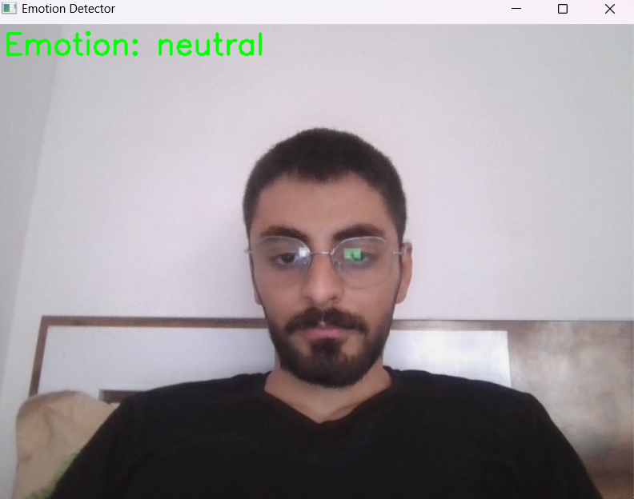
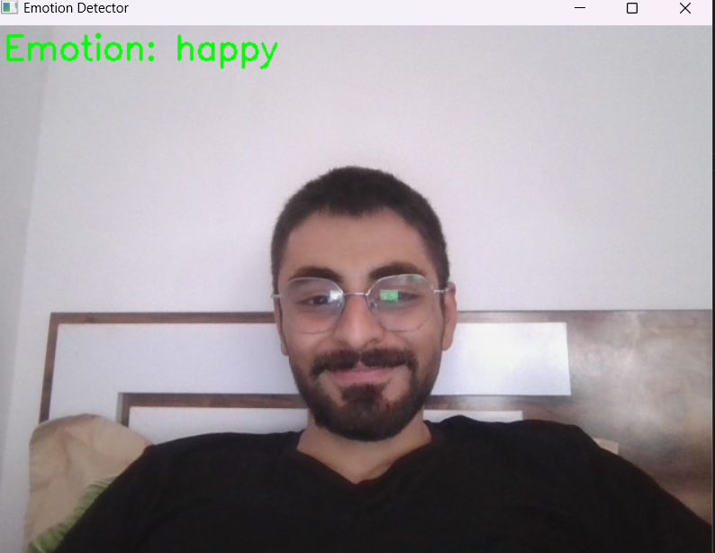

# Real-Time Emotion Detector using DeepFace

This project utilizes **OpenCV** and **DeepFace** to analyze emotions in real-time through a webcam.  
It detects various emotions such as happiness, sadness, anger, and more, displaying the dominant emotion on the screen.

## Features
- Real-time emotion detection.
- Displays the most dominant emotion on the video stream.
- Easy to set up and run locally.

## Installation
1. Clone the repository:
   ```bash
   git clone https://github.com/yourusername/Emotion-Detector.git
   ```
2. Navigate to the directory:
   ```bash
   cd Emotion-Detector
   ```
3. Install the dependencies:
   ```bash
   pip install -r requirements.txt
   ```

## Usage
1. Run the script:
   ```bash
   python main.py
   ```
2. Press `q` to exit the application.

## Example Images
Two sample images are provided in the `images/` folder for testing. These images demonstrate the functionality of the emotion detection algorithm.

| Example 1 | Example 2 |
|-----------|-----------|
|  |  |

## License
This project is open-source and licensed under the **MIT License**.
